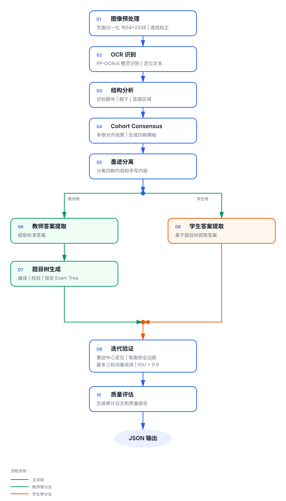

# Paper Content Extractor

从教师卷和学生卷扫描图中提取题目结构、答案槽位、教师答案和学生作答，输出可审计的 JSON、题目树、区域截图与可视化结果。

当前生产路径优先使用视觉模型直接读取原始页面。教师卷用于建立稳定的逻辑题目树，学生卷继承题目身份，但答案内容与坐标始终从各自原图独立识别。

## 主要能力

- 从多页教师卷生成章节、题目、小问和槽位拓扑。
- 在学生卷原图中独立定位并识别手写答案。
- 支持选择、填空、简答、公式、多区域答案和跨页题目。
- 对模型响应执行 Schema、页码、坐标范围和区域冲突校验。
- 对缺失结构、答案和坐标执行有上限的自动重试。
- 输出 `exam_package.v5` JSON、处理审计、性能统计和槽位叠加图。
- 提供本地 OCR 兼容路径、真值评估和 HITL 导出能力。

## 项目结构

```text
paper-content-extractor/
├── homework_extractor.py          # CLI 与主流程编排
├── exam_pipeline/                 # 核心模块
│   ├── contracts.py               # 数据契约
│   ├── document_structure.py      # 视觉题目结构生成与校验
│   ├── exam_tree.py               # 题目树编译和复用
│   ├── visual_extraction.py       # 原页联合提取
│   ├── slot_semantics.py          # 槽位语义与区域识别
│   ├── answer_vision.py           # 视觉答案转写
│   ├── answer_recognition.py      # 答案识别与状态整理
│   ├── result_contract.py         # 最终结果收敛
│   ├── quality.py                 # 质量门
│   ├── visualization.py           # 槽位可视化
│   └── evaluation.py              # 真值评估
├── dataset/                       # 当前样本数据
│   ├── chinese/                   # 1 份教师卷、4 份学生卷
│   └── math_01/                   # 1 份教师卷、3 份学生卷
├── tests/                         # 单元与契约测试
├── reports/                       # 识别结果（运行生成）
├── GROUNDING_KNOWLEDGE_BASE.md    # 定位与验证规则
├── PRODUCTION_PIPELINE_SPEC.md    # 生产流程规范
├── algorithm_flow.svg             # 流程图
└── pyproject.toml                 # 包与依赖配置
```

## 环境要求

- Python 3.8+
- OpenCV、NumPy、Pillow
- 豆包视觉模型或兼容的 PaddleOCR-VL 服务，用于完整视觉识别
- PaddleOCR 为可选依赖，仅供本地 OCR 兼容路径使用

安装核心依赖：

```bash
python3 -m pip install -e .
```

开发与测试：

```bash
python3 -m pip install -e '.[dev]'
```

需要 PaddleOCR 时，先安装与运行环境匹配的 PaddlePaddle，再执行：

```bash
python3 -m pip install -e '.[paddle]'
```

## 模型配置

推荐通过环境变量提供密钥：

```bash
export DOUBAO_API_KEY='your-api-key'
export DOUBAO_BASE_URL='https://ark.cn-beijing.volces.com/api/plan/v3'
export DOUBAO_MODEL='doubao-seed-2.0-lite'
```

程序也会读取以下私密配置文件：

```text
~/.config/intelligent-grading-system/doubao.env
```

文件示例：

```bash
DOUBAO_API_KEY=your-api-key
DOUBAO_BASE_URL=https://ark.cn-beijing.volces.com/api/plan/v3
DOUBAO_MODEL=doubao-seed-2.0-lite
```

配置文件必须限制为当前用户可读：

```bash
chmod 600 ~/.config/intelligent-grading-system/doubao.env
```

可以通过 `GRADING_SECRET_ENV` 指定其他私密配置文件。项目根目录的 `.env` 不会自动加载，`.env.example` 仅用于展示变量名称。

使用独立 PaddleOCR-VL 服务时配置：

```bash
export PADDLEOCR_VL_ENDPOINT='http://127.0.0.1:8000/v1/chat/completions'
export PADDLEOCR_VL_MODEL='PaddlePaddle/PaddleOCR-VL-1.6'
```

## 数据目录

每个科目一个目录；`teacher` 表示教师卷，其他子目录视为学生卷。每个文档内的页面按文件名自然排序。

```text
dataset/
└── subject_name/
    ├── teacher/
    │   ├── page_01.jpg
    │   └── page_02.jpg
    ├── student001/
    │   ├── page_01.jpg
    │   └── page_02.jpg
    └── student002/
        ├── page_01.jpg
        └── page_02.jpg
```

要求：

- 页面必须完整、方向正确且按顺序命名。
- 教师卷和学生卷应使用同一套题目版式。
- 一个学生目录只放一份试卷的页面。
- 建议使用 `page_01.jpg`、`page_02.jpg` 这类补零命名。

## 运行识别

完整视觉识别：

```bash
python3 homework_extractor.py dataset \
  --subject math_01 \
  --structure-vlm doubao \
  --slot-semantics doubao \
  --timeout 180 \
  -o reports/math_01_run
```

只处理指定学生；对应教师卷仍会被加载以建立题目树：

```bash
python3 homework_extractor.py dataset \
  --subject math_01 \
  --student-id student002 \
  --structure-vlm doubao \
  --slot-semantics doubao \
  -o reports/math_01_student002
```

试运行只检查数据分组，不调用模型：

```bash
python3 homework_extractor.py dataset \
  --subject chinese \
  --dry-run \
  -o reports/chinese_dry_run
```

本地 OCR 兼容路径：

```bash
python3 homework_extractor.py dataset \
  --subject math_01 \
  --structure-vlm none \
  --slot-semantics none \
  --ocr paddle \
  -o reports/math_01_local_ocr
```

生产调度可增加 `--production` 和 `--fail-on-review`。前者启用更严格的证据校验；后者在存在待复核文档时返回状态码 2。

建议每个科目使用独立输出目录。当前可视化文件按文档角色和学生 ID 命名，多科目包含同名学生时可能发生文件名冲突。

## 从头重新识别

题目树与中间结果默认缓存在 `.exam_pipeline_cache/`。如需完全从头识别，应使用新的输出目录并清除该缓存：

```bash
find .exam_pipeline_cache -depth -delete 2>/dev/null || true

python3 homework_extractor.py dataset \
  --subject math_01 \
  --structure-vlm doubao \
  --slot-semantics doubao \
  -o reports/math_01_fresh
```

Paddle 模型缓存在 `.paddlex-cache/`。它不影响视觉题目树缓存，通常无需删除。

## 当前流程



VLM-only 主流程如下，实际顺序也会写入 `manifest.json.runtime.pipeline_order`：

1. 发现教师卷、学生卷和物理页序。
2. 预处理原始页面并记录图像指纹。
3. 从教师卷生成轻量全卷拓扑，再逐页补全题干和选项。
4. 在原页中联合提取题目区域、逻辑槽位、答案区域和答案文本。
5. 学生卷继承教师逻辑题目树，在自身原页独立识别答案。
6. 对缺失区域或内容执行页级、题级有界重试。
7. 导出图示资源、区域截图和槽位叠加图。
8. 收敛结果契约并执行质量门。
9. 写出文档 JSON 与总清单。

当结构模型和槽位模型均可用时，运行模式为 `vlm_only`：

- 原始页面是题目、坐标与答案的主要证据。
- 当前路径不运行 OCR，输出中的 `ocr_used` 为 `false`。
- 坐标权限记录为 `vlm_original_page_pixels`。
- 模型响应仍需通过页码、边界、重叠和 Schema 校验。

当视觉模型关闭或不可用时，程序进入 `legacy_ocr_compatible` 路径，使用本地 OCR 与规则恢复结构。无法确认的内容保持为空或未解决，不会用参考答案补写学生结果。

## 输出目录

```text
output/
├── manifest.json
├── subject__teacher__teacher.json
├── subject__student__student001.json
├── document_structure/
├── exam_trees/
├── generated_golden/
├── normalized/
├── roi_patches/
├── visual_extraction/
├── diagram_assets/
└── visualizations/
```

`manifest.json` 汇总运行参数、文档状态、错误、耗时和模型使用情况。每份文档 JSON 包含题目结构、槽位、答案、坐标证据、阶段审计和质量状态。

精简示例：

```json
{
  "schema_version": "exam_package.v5",
  "exam_id": "math_01__student__student001",
  "subject": "math_01",
  "document_type": "student",
  "student_id": "student001",
  "recognition_mode": "vlm_only",
  "extraction_status": "COMPLETE",
  "quality": {
    "status": "OK",
    "reasons": []
  },
  "sections": [
    {
      "section_id": "section_1",
      "questions": [
        {
          "question_id": "q1",
          "items": [
            {
              "item_id": "q1",
              "standard_answer": "D",
              "student_answer": "D",
              "answer_status": "COMPLETE",
              "slots": []
            }
          ]
        }
      ]
    }
  ]
}
```

## 状态与坐标

- `quality.status=OK`：通过当前自动质量门。
- `quality.status=NEED_REVIEW`：结果已生成，但存在缺失答案、区域冲突或证据不足。
- `extraction_status=COMPLETE/PARTIAL/UNRESOLVED`：表示答案提取完整度。
- `PageRegion.bbox` 使用像素 `xyxy`。
- 兼容字段 `Slot.expected_bbox`、`handwriting_bbox` 的具体格式以 `slot_bbox_format` 为准。
- `answer_parts` 保留逻辑槽位顺序；未识别位置使用 `null`，不会压缩数组。

`NEED_REVIEW` 不会暂停批处理。需要让调度任务因待复核结果失败时使用 `--fail-on-review`。

## 测试与评估

运行测试：

```bash
python3 -m unittest discover -s tests -v
python3 -m compileall -q exam_pipeline homework_extractor.py
```

真值评估：

```bash
python3 -m exam_pipeline.evaluation prediction.json truth.json
python3 -m exam_pipeline.evaluation --manifest evaluation_matrix.json
```

评估输出题号召回、答案完整匹配、槽位 IoU、定位召回和精确率。内部阶段完成率、OCR 非空率和 `quality.status=OK` 都不等同于人工真值准确率。

## 常见问题

### 为什么没有识别某个科目？

检查科目目录中是否存在图片，以及 `--subject` 是否与目录名完全一致。空目录不会生成结果。

### 为什么结果是 `NEED_REVIEW`？

查看文档 JSON 的 `quality.reasons`、`extraction_errors`、`structure_audit` 和各槽位 `audit`。常见原因包括教师答案缺失、答案区域未找到、跨题区域冲突和模型响应不完整。

### 为什么重新指定输出目录仍复用了题目树？

题目树缓存位于项目级 `.exam_pipeline_cache/`，不在输出目录内。需要完全重跑时按“从头重新识别”一节清除缓存。

### 如何查看识别区域？

检查输出目录的 `visualizations/`、`roi_patches/` 和 `diagram_assets/`。原始模型审计位于 `visual_extraction/` 和 `document_structure/`。

## 相关文档

- [定位与验证规则](GROUNDING_KNOWLEDGE_BASE.md)
- [生产流程规范](PRODUCTION_PIPELINE_SPEC.md)
- [算法流程图](algorithm_flow.svg)
